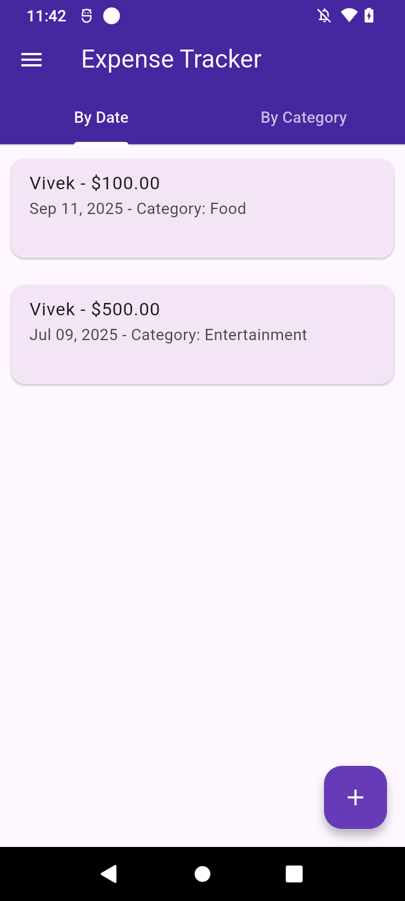
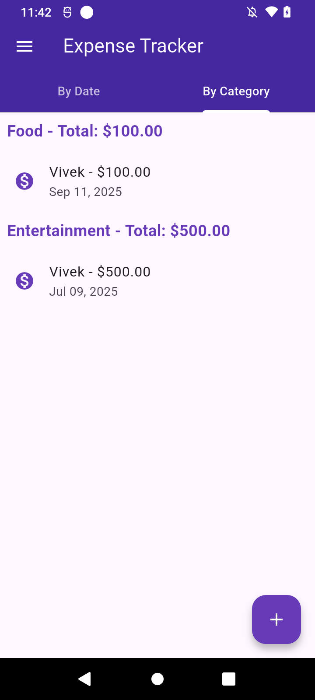
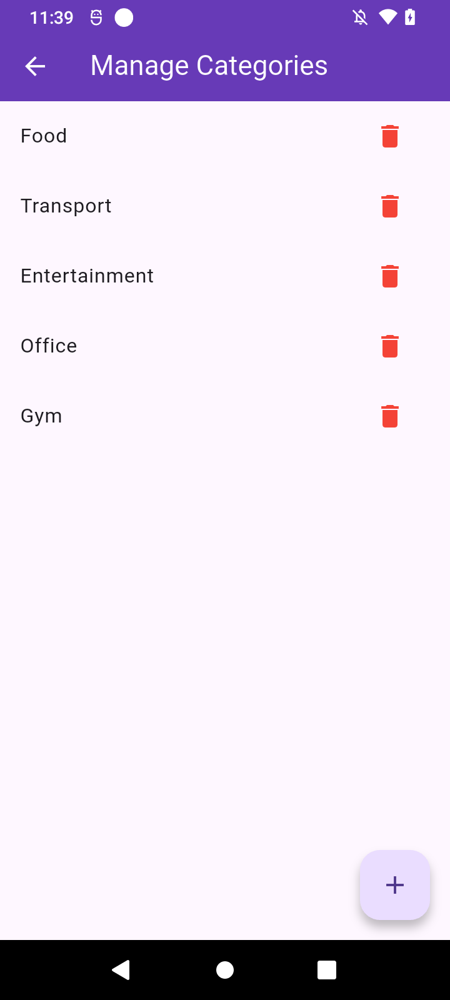
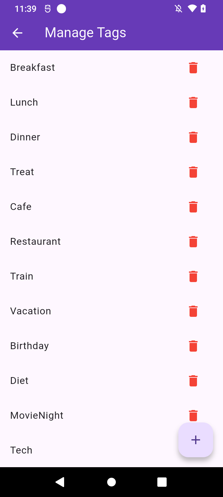
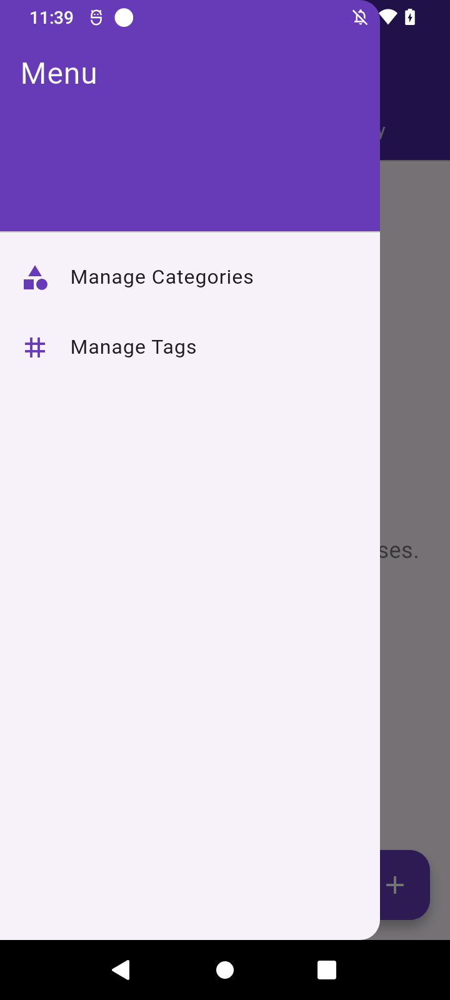

# 💰 Expense Tracker App (Flutter)

A simple and powerful **Expense Tracker app** built with **Flutter**.  
It helps you track your expenses by **category, tags, and date**, while storing data locally on the device.  
State management is handled using **Provider**.

---

## ✨ Features
- ➕ Add, edit, and delete expenses
- 🏷️ Categorize expenses (Food, Travel, Bills, etc.)
- 🏷️ Add custom tags for better filtering
- 📅 Track by date (daily, monthly, custom range)
- 💾 Data stored locally using **localstorage**
- 📊 Summary view by category and date
- 🎨 Clean and responsive UI

---

## 🛠️ Tech Stack
- **Framework:** Flutter
- **State Management:** Provider
- **Local Storage:** localstorage
- **Language:** Dart
- **IDE:** Android Studio / VS Code

---

## 🚀 Getting Started

### Prerequisites
- Install [Flutter SDK](https://flutter.dev/docs/get-started/install)
- Setup [Android Studio](https://developer.android.com/studio) or VS Code

### Installation
1. Clone this repository:
   ```bash
   git clone https://github.com/tripathivivek98/expense_manager.git
   
2. Navigate to the project folder:
    ```bash
    cd expense_tracker_flutter
   
3. Install dependencies:
    ```bash
    flutter pub get
   
4. Run the app:
    ```bash
   flutter run


## 📂 Folder Structure

  ```bash
  lib/
  ├── main.dart          # App entry point
  ├── screens/           # UI screens
  │   └── add_expense_screen.dart
  │   └── category_management_screen.dart
  │   └── home_screen.dart
  │   └── tag_management_screen.dart
  ├── models/            # Data models
  │   └── expense.dart
  │   └── category.dart
  │   └── tag.dart
  │   └── expense_category.dart
  ├── providers/         # State management providers
  │   └── expense_provider.dart
  └── widgets/           # widgets 
      └── add_category_dialog.dart
      └── add_tag_dialog.dart
  
  ```

## 📱 Screenshots
<p align="center">
  
  
  
  
  
</p>

---

## 📜 License

This project is licensed under the MIT License – see the [LICENSE](LICENSE) file for details.


## 🤝 Contributing
Contributions are welcome!<br>
Feel free to fork this repo, raise issues, and submit PRs.


👤 Author : Vivek Tripathi

💼 [LinkedIn](https://www.linkedin.com/in/vivek--tripathi/)

🐙 [GitHub](https://github.com/tripathivivek98)

